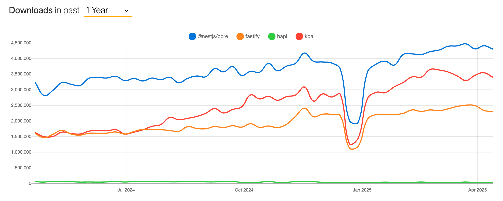

# Key Features and Advantages

## Overview

This project combines the power of NestJS with GOV.UK Frontend to create a robust, secure, and maintainable web application framework specifically designed for UK government services. The framework provides a complete solution for building government digital services that are secure, accessible, and maintainable.

## Core Features

### 1. Modern Framework Architecture

- Built on NestJS v11.1.6, providing a scalable and maintainable architecture
- TypeScript v5.9.2 with strict mode enabled for maximum type safety
- Modular design following SOLID principles with clear separation of concerns
- Dependency injection for better testability and maintainability
- Built-in support for microservices architecture
- Comprehensive middleware system for request/response handling
- Structured error handling with custom error filters
- Adapter pattern implementation for external service integration
- Core application functionality separation for better maintainability
- Monorepo architecture support for managing multiple related applications

### 2. Framework Popularity

- Second most popular Node.js web framework after Express.js, demonstrating strong community adoption and reliability
- Growing adoption rate with increasing number of downloads and active users
- [View detailed popularity trends on npmtrends.com](https://npmtrends.com/@nestjs/core-vs-fastify-vs-hapi-vs-koa)
  

### 3. GOV.UK Frontend Integration

- Seamless integration with GOV.UK Frontend v5.11.2 components
- Nunjucks templating engine - the official and default templating language used by [GOV.UK Design System](https://design-system.service.gov.uk/), ensuring perfect compatibility and maintainability
- Built-in support for [GOV.UK Design System patterns](https://design-system.service.gov.uk/)
- [WCAG 2.2 Accessibility compliance](https://design-system.service.gov.uk/accessibility/wcag-2.2/) built into the codebase
- Automatic asset serving from node_modules
- Optimised static asset delivery with caching headers
- Support for GOV.UK Frontend JavaScript components
- SASS preprocessing for custom styling
- Automatic HTML updates with each [GOV.UK Frontend](https://github.com/alphagov/govuk-frontend/releases/latest) release through Nunjucks macros, ensuring seamless upgrades and compatibility

### 4. Security Features

- Helmet.js v8.1.0 integration with custom security configurations
- Built-in rate limiting with @nestjs/throttler v6.4.0
- Compression middleware for optimised performance
- Environment-based configuration management
- Custom CSRF protection with cryptographic token generation:
  - No external dependencies for enhanced security
  - Cryptographically secure random token generation
  - Timing-safe token comparison
  - Automatic token rotation
  - Secure cookie settings with HttpOnly and SameSite flags
  - Configurable token expiration
  - Path-based protection rules
- Content Security Policy with nonce-based script security
- Comprehensive security headers
- Strict permissions policy
- CORS configuration
- CSP violation reporting
- Request validation using class-validator v0.14.2
- Security error filtering and logging
- Session management
- JWT support for authentication
- Express v5.1.0 with enhanced security features

### 5. Developer Experience

- Comprehensive testing setup
  - Jest v30.1.1 for unit and integration testing
    - Full Performance API mocking for accurate performance testing
    - Type-safe test utilities with TypeScript
    - Custom test matchers for common assertions
    - Global test configuration and setup
    - Mock utilities for common browser APIs
  - Playwright v1.55.0 for end-to-end testing
    - Cross-browser testing (Chrome, Firefox, Safari)
    - Automatic waiting and retry mechanisms
    - Screenshot and video capture
    - Interactive debugging with UI mode
    - Parallel test execution
    - Mobile device emulation
    - Network request interception
    - Built-in test reporting
- Advanced Error Handling
  - Intelligent 404 error handling with pattern-based exclusions:
    - Clean console output by filtering browser-generated requests
    - Support for exact matches and extension wildcards
    - Configurable path exclusion patterns
    - Detailed error responses for legitimate 404s
    - Automatic handling of source map and favicon requests
  - Structured error handling with custom error filters
  - Comprehensive error logging and monitoring
  - User-friendly error messages
  - Error recovery strategies
  - Error boundary implementation
  - Error state management
- Comprehensive build system with task-specific scripts
  - Backend compilation and running in various modes
  - Frontend asset building with separate concerns
  - Watch modes for development with hot-reload
  - Production-ready builds with optimizations
  - Asset fingerprinting and management
  - Incremental builds for faster development
  - Code quality scripts for formatting and linting
  - Testing scripts for various testing strategies
    - Unit and integration testing with Jest
    - End-to-end testing with Playwright
    - Component testing for GOV.UK Frontend
    - Coverage reporting and analysis
- Swagger/OpenAPI documentation with automatic generation
- Winston v3.19.0 logging integration with structured logging
- Prettier v3.8.0 and ESLint for code quality
- Hot-reload development environment
- TypeScript decorators for clean code
- Built-in validation and transformation
- Clear error messages and debugging support
- Supertest v7.2.2 for API testing
- Node.js v25.5.0+ support with modern features
- PostCSS v8.5.6 for modern CSS processing
- Babel v7.28.6 for JavaScript transpilation

### 6. Performance Optimisation

- Redis caching support with cache-manager v7.2.8
- Static file serving optimisation with custom headers
- Compression middleware with configurable options
- Axios v1.11.0 HTTP client for efficient API calls
- Request batching support
- Connection pooling
- Response compression
- Asset versioning and caching
- ioredis v5.9.3 for Redis operations
- Code splitting and lazy loading
- CSS optimisation with PostCSS
- Service worker for offline support
- Performance monitoring and metrics
- Resource timing tracking
- Long task detection
- Navigation timing metrics
- Cache-first strategy for static assets
- Real-time performance tracking
- User interaction monitoring
- Visual performance metrics
- Layout shift monitoring
- First input delay tracking
- Largest contentful paint tracking
- Time to interactive monitoring
- Total blocking time tracking
- Comprehensive performance configuration
- Configurable static asset caching
- Optimised compression settings
- Browser caching strategies
- API performance monitoring
- Connection pooling
- Request batching
- Response compression
- Cache control headers
- Optimised view engine configuration
  - Autoescaping for security
  - Environment-based caching
  - Template optimisation
  - Memory usage optimisation
  - Error handling
- Efficient route handling
  - Logical route organisation
  - Middleware optimisation
  - Route-specific middleware
  - Performance monitoring
  - Error handling

### 7. Asset Fingerprinting

- Content-based fingerprinting without Webpack or other bundlers
- Automatic hash generation based on file content
- Manifest file for mapping original paths to fingerprinted versions
- Nunjucks integration via `assetPath` template function
- Immutable caching for maximum performance:
  - Cache-Control headers with immutable flag
  - One-year cache duration for fingerprinted assets
  - No revalidation requests on page refresh
- Special handling for different asset types:
  - CSS with source map preservation
  - JavaScript files
  - Images
  - Font files
- Built-in handling for GOV.UK Frontend assets
- Simple build process integration
- Clear documentation and usage examples
- Significant performance benefits:
  - Reduced bandwidth usage
  - Faster repeat visits
  - Lower server load
  - Automatic cache busting when content changes

## Government Service Benefits

### 1. Security and Compliance

- Built-in security features aligned with government security standards
- Automatic compliance with GOV.UK Design System
- Structured logging for audit trails
- Built-in protection against common security vulnerabilities
- Easy integration with government authentication systems
- CSRF protection for forms
- Content Security Policy
- Comprehensive security headers
- Strict permissions policy

### 2. Accessibility and Standards

- Automatic compliance with WCAG 2.2 standards through GOV.UK Frontend
- Built-in support for accessibility testing
- Consistent user experience across government services
- Automatic handling of accessibility requirements
- Support for assistive technologies

### 3. Performance and Scalability

- Optimised for high-traffic government services
- Built-in caching for improved performance
- Automatic handling of peak loads
- Efficient static asset delivery with fingerprinting
- Support for multiple environments (development, staging, production)
- Advanced frontend optimisation
- Offline support and caching
- Performance monitoring and metrics
- Real-time performance tracking
- User interaction monitoring
- Visual performance metrics
- Immutable asset caching for maximum performance

### 4. Development and Maintenance

- Reduced development time through built-in features
- Easier onboarding for new developers
- Better code quality through enforced patterns
- Simplified maintenance through modular design
- Comprehensive build scripts for all development tasks
- Well-documented build and deployment processes
- Automatic documentation generation
- Built-in testing support
- Modern frontend tooling
- Efficient development workflow
- No complex bundler configuration needed

## Java API Integration Advantages

### 1. Seamless Backend Integration

- **Axios HTTP Client**: Built-in support for making HTTP requests to Java APIs
- **Type Safety**: TypeScript interfaces can mirror Java DTOs for end-to-end type safety
- **Request/Response Transformation**: Built-in class-transformer for mapping between Java and TypeScript objects
- **Validation**: Class-validator integration for consistent validation between frontend and Java backend

### 2. API Documentation Integration

- **Swagger/OpenAPI Support**: Native support for consuming Java Spring Boot Swagger documentation
- **Type Generation**: Automatic TypeScript type generation from Java API documentation
- **API Client Generation**: Tools for generating strongly-typed API clients from Java API specs
- **Documentation Synchronisation**: Easy to keep frontend and backend documentation in sync

### 3. Security Integration

- **JWT Support**: Built-in support for JWT authentication commonly used in Java applications
- **Session Management**: Flexible session handling compatible with Java session management
- **CORS Configuration**: Easy configuration for cross-origin requests to Java APIs
- **CSRF Protection**: Built-in CSRF protection compatible with Java security implementations
- **Content Security Policy**: Comprehensive CSP configuration
- **Security Headers**: Enhanced security headers
- **Permissions Policy**: Strict permissions policy

### 4. Performance Optimisation

- **Caching Layer**: Redis caching can be used to reduce load on Java APIs
- **Request Batching**: Support for batching multiple API calls to reduce network overhead
- **Response Compression**: Built-in compression for efficient data transfer
- **Connection Pooling**: Optimised HTTP client configuration for Java API connections
- **Frontend Optimisation**: Advanced frontend optimisation for better user experience
- **Offline Support**: Service worker for offline access to cached resources
- **Performance Monitoring**: Comprehensive performance metrics collection
- **Real-time Tracking**: Real-time performance tracking and monitoring
- **User Interaction**: User interaction monitoring and analysis
- **Visual Metrics**: Visual performance metrics and analysis
- **Asset Fingerprinting**: Content-based fingerprinting for optimal caching

### 5. Development Workflow

- **Environment Configuration**: Easy configuration management for different Java API environments
- **Mocking Support**: Built-in tools for mocking Java API responses during development
- **Error Handling**: Consistent error handling patterns between Java and TypeScript
- **Logging Integration**: Winston logging can be configured to match Java logging patterns
- **Frontend Tooling**: Modern frontend development tools and optimisation

## Use Cases

This framework is particularly well-suited for:

- UK government digital services requiring:
  - [High security standards and compliance](https://www.security.gov.uk/policy-and-guidance/standards/)
  - [GOV.UK design system integration](https://design-system.service.gov.uk/)
  - [Accessibility compliance (WCAG 2.2)](https://design-system.service.gov.uk/accessibility/wcag-2.2/)
  - [Integration with other government systems](https://www.sign-in.service.gov.uk/)
- Applications needing:
  - Scalable and maintainable architecture
  - Complex business logic handling
  - Comprehensive documentation
  - Robust error handling and logging
  - High performance and offline capabilities
  - Real-time performance monitoring
  - Advanced security features (CSRF, CSP, etc.)
  - Microservices architecture implementation

## Microservices Architecture Support

The project includes comprehensive support for implementing microservices architecture:

### 1. Built-in Microservices Capabilities

- **Transport-agnostic messaging**: Support for TCP, Redis, MQTT, NATS, RabbitMQ, Kafka, and gRPC
- **Message patterns**: Request-response, event-based, and hybrid approaches
- **Multiple server instances**: Run HTTP and microservice servers simultaneously
- **Serialization support**: JSON, MessagePack, and protocol-specific serializers

### 2. Microservices Implementation Patterns

- **Backend-for-Frontend (BFF)**: Optimized frontend services for specific clients
- **API Gateway**: Route and transform requests to appropriate services
- **Event-driven architecture**: Publish and subscribe to events across services
- **Service discovery**: Integration with service registries and load balancers
- **Circuit breakers**: Prevent cascading failures across services
- **Distributed tracing**: Track requests across multiple services

### 3. Microservices Benefits

- **Independent deployability**: Update services without affecting others
- **Team autonomy**: Different teams can own different services
- **Technology flexibility**: Use optimal technologies for each service
- **Scalability**: Scale individual services based on demand
- **Resilience**: Failure in one service doesn't affect the entire system
- **Enhanced security**: Secure service-to-service communication
- **Optimized development**: Focused codebases for easier maintenance

See our [Microservices Architecture Guide](./microservices-architecture.md) for detailed implementation guidance.

## Performance Optimizations

### Response Compression

The application implements response compression to reduce bandwidth usage and improve load times:

- **Compression Middleware**
  - Uses the `compression` package for efficient response compression
  - Configurable compression level (default: 6)
  - Threshold-based compression (default: 1kb)
  - Automatic content-type detection
  - Configurable through the ConfigService

- **Benefits**
  - Reduced bandwidth usage
  - Faster page loads
  - Lower server load
  - Better user experience

### Browser Caching

Browser-side caching is implemented to improve performance and reduce server load:

- **Cache Middleware**
  - Configurable cache duration
  - Automatic cache invalidation for authenticated routes

### Asset Fingerprinting

Content-based fingerprinting for static assets enables optimal browser caching:

- **Implementation**
  - Generates MD5 hashes based on file content
  - Appends hash to filename before extension (e.g., `main.a1b2c3d4.css`)
  - Creates manifest file mapping original paths to fingerprinted paths
  - Template function for resolving paths
  - Special handling for various asset types

- **Caching Strategy**
  - Cache-Control: public, max-age=31536000, immutable
  - One-year cache duration
  - Immutable flag prevents revalidation
  - ETags and Last-Modified headers for conditional requests

- **Benefits**
  - Significantly faster repeat visits
  - Reduced bandwidth usage
  - Lower server load
  - Automatic cache invalidation when content changes
  - No complex bundler configuration needed
  - Transparent integration in templates
